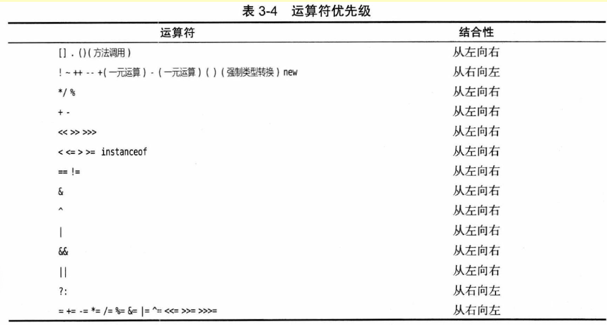

### 代码单元和码点

java中char类型描述了UTF-16编码中的一个代码单元。  而码点是一个个完整的字符。所以一个char类型的变量可能并不能显现成一个字符，它可能仅是一个字符的一部分。

char值的十六进制：'\u0000'到'\uFFFF'


Unicode转义序列会在解析代码前得到处理。注释中的`\u`要小心处理，会被直接解析并替换

```java
//\u000A is newline

//look inside c:\users

都会产生错误，前者直接转换为换行符，后者\u后面没有四个十六进制数
```

length方法返回的是代码单元数量，不是码点数量。

要获得码点数量，用codePointCount方法：`int cpCount = greeting.codePointCount(0, greeting.length())`

```java
//获得代码单元（char类型）
char first = greeting.charAt(0);
char last = greeting.charAt(greeting.length()-1);
//获得码点（int类型）
int index = greeting.offsetByCodePoints(0, i);
int cp = greeting.codePointAt(index);

//遍历字符串，依次查看每一个码点
int cp = sentence.codePointAt(i);
if (Character.isSupplementaryCodePoint(cp)) i += 2; //如果代码单元是supplementary，证明后面还有一个代码单元
else i++;
//反向遍历
i--;
if (Character.isSurrogate(sentence.charAt(i))) i --;
int cp = sentence.codePointAt(i);
```

使用codePoints方法，生成int“流”，每个int对应一个码点。

`int[] codePoints = str.codePoints().toArray();`

再用构造器转换为一个字符串：

`String str2 = new String(codePoints, 0, codePoints.length)`

==上面代码的length是一个属性。（String的length是一个方法，Array的length是一个属性 WTF）==


### StringBuilder 类

先构建一个空的字符串构建器

需要添加内容的时候使用.append()；（参数可以是char也可以是String）

完成以后调用.toString()，生成一个String类型的字符串

#todo 调用.toString()以后，还可以继续append吗？

### var关键字

如果能够从变量的初始值推断出它的类型，就不需要再声明类型

### 常量

关键字final指示常量

### 类常量（class constant）

如果希望某个常量可以在一个类的多个方法中使用，则可以使用关键字static final设置类常量。类常量的定义位于main方法的外部。

### 枚举类型

自定义枚举类型语法：`enum Size { SMALL, MEDIUM, LARGE, EXTRA_LARGE }`，然后可以声明这种类型的变量：

`Size s = Size.SMALL;`

先要声明枚举类型（先自定义），再声明枚举类型的变量。枚举类型的变量只能存储这类类型声明中给定的某个枚举值或者特殊值null（表示没有设置任何值）

### 关键字public是一个访问修饰符（access modifier），用于控制程序的其它部分对于这段代码的访问级别。

### 源代码的文件名必须与公共类的名字相同。

### 类名是以大写字母开头的名词。如果名字由多个单词组成，每个单词的第一个字母都应该大写（大驼峰）

### main方法没有为操作系统返回“退出码”。如果正常退出，那么java应用程序的退出码是0。如果希望返回其他的退出码，需要使用`System.exit`方法。

### Java与C/C++一样，都是用双引号界定字符串。（与js不同）

### Java中/**/注释不可以嵌套

### Java中可以表示任意精度的算术包称为大数（big number），虽然称为大数，但是它不是一种Java基本类型，而是一个Java对象。

### 整形的存储需求、范围

1byte = 8bit，bit存储0和1

byte 1字节（字节英文就是byte）-128～127

==计算方法：2^8 = 256；256/2=128，正数部分是127是因为0也要占一个。==

short 2字节 -32768～32767

int 4字节 -2_147_483_648 ~  2_147_483_647（刚超过21亿）

long 8字节 -9_223_372_036_854_775_808 ~ 9_223_372_036_854_775_807

Java中整形的范围与运行Java的机器无关。

长整型数值有一个后缀L或者l（大小写的L）

八进制前缀：0（零octal）

十六进制前缀：0x或者0X（零X：hexadecimal）

二进制前缀：0b或者0B（零B：binary）

Java7开始才可以使用下划线作为千分位

Java没有任何无符号（unsigned）形式的整型。

char类型是16位、两个字节

### 浮点数范围：

float 4字节 +-3.40282347E+38F（有效位数是6～7位）

double 8字节 +-1.79769313486231570E+308（有效位数为15位）

十六进制的浮点数：使用p表示指数，而不是e（因为十六进制的数位中包括e，从0～f）。

三个特殊的浮点数值：

正无穷：Double.POSITIVE_INFINITY

负无穷：Double.NEGATIVE_INFINITY

NaN（not a number）：Double.NaN

检测NaN的方式：Boolean Double.isNaN(x)

### 被0除

整数除以0会产生异常，而浮点数除以0将会得到无穷大或者NaN。

### 对于方法和静态方法的理解

System.out.println()方法处理System.out对象

而Math.sqrt()方法不处理任何对象，这样的方法被称为静态方法。（类似无副作用的函数）

### 整数余数的问题

运算符`%`对于n%k，如果n是负数，会获得结果-1

floorMod方法对于floorMod(position + adjustment, 12)总会获得0～11之间的数。（如果除数是负的，仍然会得到负数结果）

### Math类的溢出处理

将10亿乘以3的计算结果赋值给int类型，结果会是-1294967296（int最大值只比21亿大一点）。如果使用multiplyExact方法，会抛出异常。另外还有addExact、subtractExact等方法也可以正确处理int和long参数。

### 强制类型转换（cast）

cast意思是投射、浇铸。如下面例子，long转int，由于存在信息丢失的可能性，所以只能通过显示强制类型转换才能够将long转换为int。

（也就是说，如果信息不会丢失，是可以进行转换的，#todo 这个叫隐式转换？）

```java
double x = 9.997;
int nx = (int) x;

double x = 9.997;
int nx = (int) Math.round(x);
```

### Math.round(x)

如果x是float，返回值是int；如果x是double，返回值是long

### 短路求值

&&逻辑与：一个假全都假，前面的表达式只要是false，后面的就不运算了

||逻辑或：一个真全都真，前面表达式只要是真，后面的就不运算了

### String是引用类型

如果使用`==`来检测两个字符串的相等性，不一定会得到正确的结果。因为`==`操作符只能用来确定两个字符串是否存储在相同一个位置上（比较引用是否相等）。只有字符串字面量是存储在相同位置上的，使用`+`或者substring等操作得到的字符串并不共享。

应该使用`xxx.equals(yyy)`来判断，也可以使用`xxx.equalsIgnoreCase('hello')`来忽略大小写检测。

### 不可变的字符串（immutable）

与C/C++不同，Java中的字符串不是一个字符数组。

无法更改字符串中某一个单元序列，但是可以修改字符串变量的引用。

### 字符串的repeat方法是Java11中才提供的

### 字符串的join方法是静态的

```java
String all = String.join(" / ", "S","M","L","XL"); //all is "S / M / L / XL"
```

这与js中数组的join方法完全不同。

### 可以用`+`进行字符串拼接

#todo 必须是加号前面字符串后面不是字符串吗？可以不可以反过来？

### 字符串的子串

`xxx.substring(startIndex, endIndex);` 取到endIndex之前

### 检查一个字符串既不是null也不是空串（避免NullPointerException, NPE）

`if (str != null && str.length() != 0)`

#jsdiff ==Java中检测字符串长度的length是一个方法，不是一个属性==

### String与char[]

字符数组可以是String构造函数的参数。

要把字符串转为字符数组，要使用String.toCharArray()函数

"xxx".split()方法返回的是字符串数组，而不是字符数组

### String与byte[]

### 位运算

#todo

### 运算符级别



### 读取标准输入流

#### Scanner对象

Scanner(InputStream in)，参数是InputStream类型

首先构造一个与“标准输入流”System.in关联的Scanner对象，这个对象具有nextLine()、nextInt()、nextDouble()方法

#todo 如果输入的数据格式不对怎么办？

#### Console类

只能一行一行的输入

```java
Console cons = System.console();
String username = cons.readLine("User Name: "); //参数是一个String的prompt
char[] passwd = cons.readPassword("Password: ");
```

Console类和Scanner对象不同：

* 产生方式不同，Scanner对象是构建器new出来的，Console对象是System.console()方法返回的
* 参数不同。Scanner构建器的参数是输入流对象，实例对象的方法调用时不需要参数。System.console()调用时不需要参数，返回的Console对象调用方法时需要参数 。

#todo static方法和static变量

static变量是该类型所有实例共有的，static方法不依赖实例，直接可以调用。static类型在实例初始化之前就可以调用。

参考资料：https://www.cnblogs.com/dolphin0520/p/3799052.html

### printf

可以格式化输出。%s转换符可以格式化任意对象。

String类：

static String format()，创建一个格式化字符串，而不打印输出。

格式说明符的语法图：


### 文件输入输出

文件读取要借助Scanner对象，文件写入要借助PrintWriter对象

Scanner构造器接受一个Path.of(String path_to_file, StandardCharsets.UTF_8);的返回值

如果Scanner构造器接受一个String参数，那么字符串数据是读取的数据。

注意：文件名包含反斜杠`\`的话要再用一个反斜杠转义

记住反斜杠方向的技巧：大写字母N是no的开头字母，中间斜杠的方向就是反斜杠

PrintWriter构造器接受(String path_to_file, StandardCharsets.UTF_8)的参数

String dir = System.getProperty("user.dir");获得Java虚拟机启动目录的位置

打开不存在的文件或者用无法创建的文件名构造PrintWriter会抛出IOException异常。

可以用shell重定向语法将任意文件关联到System.in和System.out

`java MyProg < myfile.txt > output.txt`

### 控制流程

break关键字后面可以带标签

### 作用域

==不能在嵌套的两个块声明同名的变量==，会报错，无法通过编译。这与C/C++不同。

java中的块可以区隔本地变量。可以凭空用{}拉起一个块，并在里面定义一个变量。thread进入这个块之前，这个变量不存在，离开这个块以后，这个变量也不存在。

类的成员变量在声明的时候会有自动初始化，而本地变量不会。

### case标签的类型要求

整型常量表达式

枚举常量

Java7开始，还可以使用字符串字面量

#todo case标签的类型要求必须是常量吗？

### 常量表达式

#todo 是在**编译期**间能计算出来的值

source：https://docs.oracle.com/javase/specs/jls/se8/html/jls-15.html#jls-15.28

中文：https://www.cnblogs.com/iamzhoug37/p/4375684.html

case标签用枚举值时，不必指明枚举值

```java
Size sz = ...;
switch (sz) {
  case SMALL: //不必使用Size.SMALL
    ...
    break;
}
```

标签表达式后面都是冒号(:)

### 带标签的break

标签必须放在希望跳出的最外层循环之前

continue也可以带标签

### 数组

#### 声明和初始化

数据类型后面带[]，构建器是数据类型，后面也要带[]，方括号里面带元素数量

`int[] a = new int[100];`，可以用var

数组创建后不可以修改长度，如果需要修改长度需要使用**数组列表**（array list）

创建数组并同时提供初始值：

`int[] smallPrimes = { 2, 3, 5, 7, 11, 13 };`

匿名数组语法：

`new int[] { 17, 19, 23, 29, 31, 37 }`

可以直接用简写形式赋值吗？

- 只能用在初始化器中，不能用在已经声明的赋值中
- 如果数组已经被创建，只能用匿名数组语法

长度为0的数组与null并不相同

数组创建后的初始值

* 数字数组，初始化值为0
* boolean数组，初始化值为false
* 对象数组，初始化值为null
* 字符串数组的初始化值也是null

数组可以被直接赋值为null。所以函数参数为数组类型时，接收value要小心

#### 数组的for each循环

for (variable : collection) statement

#### toString方法

toString是一个static方法，（类名是Arrays，注意结尾的复数s，WTF。在util包里）需要用Array.toString()调用，这与js不同。

实例方法toString，与直接println(arr)相同

#todo 使用arr.toString()，返回的是数组内存地址？

#### 数组的拷贝

直接赋值，等于共同引用同一个数组

可以用xx[] Arrays.copyOf(originArr, length_of_the_new_arr)；第二个参数可以用来增加数组的大小（伸缩）

#### 数值型数组的排序

Arrays类中的sort方法

### do while语句中，while表达式后面要有分号

### for循环中，每个分号分隔的表达式中可以放置用逗号“，”分隔的多个表达式

### for each循环中不能修改数组元素

### byte short char类型的数据，互相可以进行数学运算，但是会产生一个类型为int的结果。这三种类型的数据中，两个同类型的数据运算后也会产生int结果

但是自增 、自减后得到的数据类型与原来的数据类型相同（不变）

### String字面量可以直接接“.”操作符，使用字符串的方法

### 当函数期望的参数类型比调用函数时给的值的类型宽的时候，编译器能悄悄替你把类型转换好。

### 可变参数

```java
class Group {
    private String[] names;

    public void setNames(String... names) {
        this.names = names;
    }
}
```

### 有关随机数

java.util.Random类的实例可以生成随机数：

```java
Random r = new Random();
r.nextInt(); // 2071575453,每次都不一样
r.nextInt(10); // 5,生成一个[0,10)之间的int
r.nextLong(); // 8811649292570369305,每次都不一样
r.nextFloat(); // 0.54335...生成一个[0,1)之间的float
r.nextDouble(); // 0.3716...生成一个[0,1)之间的double
```

我们创建`Random`实例时，如果不给定种子，就使用系统当前时间戳作为种子，因此每次运行时，种子不同，得到的伪随机数序列就不同。

如果我们在创建`Random`实例时指定一个种子，就会得到完全确定的随机数序列。

```java
public class Main {
    public static void main(String[] args) {
        Random r = new Random(12345);
        for (int i = 0; i < 10; i++) {
            System.out.println(r.nextInt(100));
        }
        // 51, 80, 41, 28, 55...
    }
}
```

前面我们使用的`Math.random()`实际上内部调用了`Random`类，所以它也是伪随机数，只是我们无法指定种子。

### Java中分⼦为0的运算情况

情况⼀：分⼦分母都为整数

3/0或0/0

分⼦分母都是整数，且分母为0，则会抛出异常java.lang.ArithmeticException

情况⼆：分⼦分母有⼀个为浮点数，分⼦为0

3.0/0或3/0.0

分⼦分母中有⼀个或两个都是⼩数，且分母为0分⼦不为0，则运⾏结果是Infinity（⽆穷⼤）

因为如果包含⼩数，即是浮点型数据，则另⼀个数据也会先转换成浮点型数据后再参与运算，⽽0.0并不是真正意义上的0，它只不过是⾮常接近0⽽已，所以⼀个⾮零的数除以⼀个接近0的数就是⽆穷（包括正⽆穷和负⽆穷）

情况三：分⼦分母有⼀个为浮点数，分⼦分母都为

0

0/0.0 或0.0/0

分⼦分母都是0，且其中⼀个或两个都是⼩数，运⾏结果是NaN（Not an Number）

因为分⼦分母都会转换成浮点数，⽽0.0并不是真正意义上的0，它只不过是⾮常接近0，两个接近0的数相除，所以运⾏结果是NaN.
